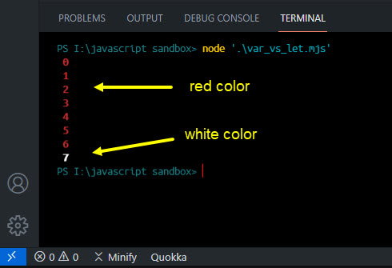

# VS Code terminal colors

Download the **UTILITY__colors.mjs** file, or view the raw code here in GitHub and copy/paste into your own file.

### requirements
Tools and software I used...

* VS Code
* PowerShell 7.1
* VS Code extension "jshint" (version 0.11.0)
* basic understanding of javascript variables (var, let, const)

## What it does
It's a Javascript Module that allows you to add custom colors (limited to about 7-9) to your console. Import it as a module for any of your javascript testing projects.

To modify the code and change the colors or the name of the color function, watch the YT vid below...

## YouTube Explanation

Watch me <a href="https://youtu.be/xld2WO09wRk" target="_blank">here</a>. There is a sample project, which sparks your imagination to begin using console colors to visually see differences in your js testing.

As always, happy coding!

— freddy

P.S. (special shout out to Terri... hi, Terri!)
